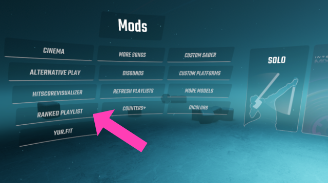

# RankedPlaylistGenerator

* Other languages: [English](README.md), [日本語](README.ja.md)

A Beat Saber Mod that generates a playlist of ScoreSaber ranked beatmaps by difficulty.

## Requirements

* Beat Saber 1.16.4
* BSIPA 4.1.4
* BeatSaberMarkupLanguage 1.4.5
* SiraUtil 2.4.0
* BeatSaberPlaylistsLib 1.4.0

## Download

* [RankedPlaylistGenerator.zip (Latest)](https://github.com/aplulu/ranked-playlist-generator/releases/latest/download/RankedPlaylistGenerator.zip)

## Installation

Unzip the contents in [RankedPlaylistGenerator.zip](https://github.com/aplulu/ranked-playlist-generator/releases/latest/download/RankedPlaylistGenerator.zip) and place it in your Beat Saber installation directory. (e.g. `C:\Program Files (x86)\Steam\steamapps\common\Beat Saber`)

## Usage

Click the `RankedPlaylist` button that appears in the Mod menu.

## Contact

* Twitter [@aplulu_cat](https://twitter.com/aplulu_cat)
* Discord Aplulu#2369
